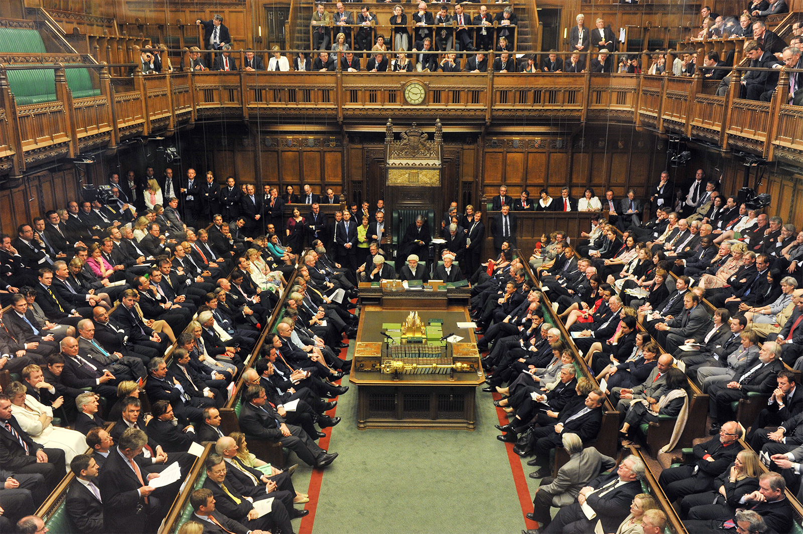
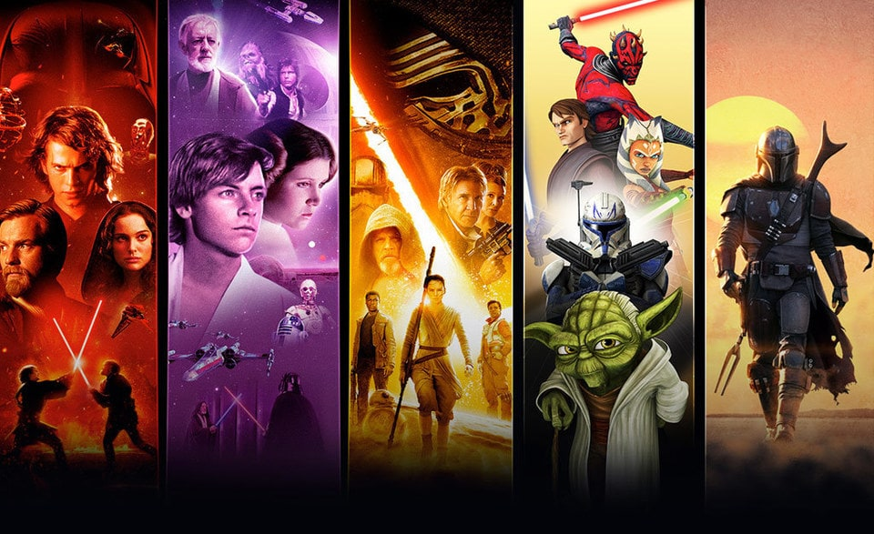

---
ebook:
  title: Lecture 01

export_on_save:
  ebook: "html"

---

# Introduction to Technology Battles

**Date**: 2019-10-07

# Table of Contents

[TOC]

-----

# What is a battle? [📹0:00](https://youtu.be/GAPFpCKG7do)
## A case study based on debates!
What is a case study?
- Business ideas
- Analyzing competing solutions
  - Exploit the topic → pros and cons
  - Story to illustrate a concept

## Main key points for a battle

### Different angles of perspective on Case Studies

#### Induction

- Achiving generalization starting from particular scenarios
  - `Example:` _Telling general law starting from large number of examples_

##### Problems of Induction

- Wrong generalization
  - `Example:` _Racism_
- Impossible to make a generalization because of:
  - The past may not reflect the future
  - Not enough datapoints - even though it might cover all the cases, it might not have enough datapoints to make a conclusion on those who are most common or not
  - Wrong dataset - it may not cover all the cases or be biased
  - Unknowingly partial dataset - sometimes we don't know that our dataset is partial because we don't have knowledge about the full range of possible datapoints.

`Example:` _A case when induction is not applicable: "A farmer feeds a turkey everyday at 8am in any weather conditions, without failing. On a given day, the turkey is expecting to be fed but the farmer got there and kill it for thanksgiving" Karl Popper._

#### Deduction

* Having a general law and deducting specific cases

**Scientific method** is falsificatory bacause it does not prove that some law is true. You're tring to find situations where the law does not apply.

##### Problems of Deduction

- The past may not reflect the future
- When people are sure about a thing they will continue to search for arguments that support they theory and not arguments against
  - `Quote:` _It is a capital mistake to theorize before one has data. Inevitably, one begins to twist facts to suit theories, instead of theories to suit facts._
    _\- Sherlock Holmes (2009 film)_
  - `Example:` _The flat-earth theory_
  - `Example:` _Conspiracy theories_

### British Parliament

Key points:
- **Moderation**
- People **stand up** when they talk
- People are **not ashamed** to be expressive
- **Shout** if agree or not
- There is a **procedure** and a process
- Desingated **place** and **representatives**
- **Bold presence**
- **Summarize** their ideas
- **Sarcasm** and **theatrics**

The people who speak at the british parliament are leaders as they have qualities from above that characterise them as such. For battles, participants are expected to behave as leaders as it is a simulation of real life with real problems.

# Why battles to teach I&E? [📹35:02](https://youtu.be/GAPFpCKG7do?t=2102)

Battles are used to talk about **innovation** because:

* They're fun
* Open-mindeness
* Stimulate critical thinking
* It's what we need to need in order to push an innovation forward in real life

Battles are also for **entrepreneurship** because:

* **Boldness**, speaking as representatives of your ideas
* There's a need to be **prepared to answer** questions that have not been previously stipulated, we need to make sense of the general situation
* **Competitiveness** - we have to persuade other people to agree with our idea, there's a need for consensus
* **Persuasiveness**

## Open/Close debates

There are two types of debates:

* **Open debate** - there's no clear answer year, there is still discussion about the topic with competing possible solutions. `Example:` _Privacy, climate change, exploiting natural non-renewable resources, …_
* **Closed debate** - discussions about ideas that have been already established `Example:` _Voting rights to women, is junk food good or not, …_

# Retrospective vs Prospecting reasoning  [📹44:41](https://youtu.be/GAPFpCKG7do?t=2676)

Debates can be **retrospective** or **prospecting**

## The Star Wars experiment

**Constructing a prequel**: speaker summarizes the story from the IV to the VI and then he describe the I. The test subject must guess what happens in the II and III.

**Constructing a sequel:** The speaker summarizes the story now starting in the chronological order from the I to the IV. The test subject must guess what happens in the last films (V and VI).

### Outcomes of the experiment

It is way easier to construct the prequel (past) because we already know what the future holds, we can easily make connections between the different events of the future to derive something from the past. Doing the opposite, imagining the future from only knowing the past and present, is way harder because it leaves us with a whole world of possibilities.

## Retrospective reasoning
Main question is: **Given the current state of the world, how did we get here?**

State of the world → Analysis → Explanation

**Goal**: retrospectively find answers

## Prospecting reasoning
Given an alternate beginning, how could it end?

Alternative beginning → Controversy → Reconciliation

**Goal**: create questions, affect final result

# Conflict and competition [📹1:03:53](https://youtu.be/GAPFpCKG7do?t=3833)
**Cooperation** → write the report together
**Competition** → fight against each other

## Disruptive innovation

Disruptive innovation faces a market that is **very big**. They position themselves in a given market and change the paradigm of things are done.

`Example:` Iliad for the price, Revolut and N26 because they are completely digital banks.

## Incremental innovation

In incremental innovation we start to get a niche of the market and once the innovation is taken over we try to deploy your new product in other product niche.

`Example:` Facebook was initially seen as a better way of doing social networks but ended up being disruptive because they completed changed the market.

If two business people are to open a restaurant and a ice cream shop, it initially appears that they are not different markets and appeal to different people but there is competition underlying. For example, in the physical space to advertise.

# Who wins a battle? [📹1:14:47](https://youtu.be/GAPFpCKG7do?t=4487)

- The more persuasive and convincing team

# Battle contents [📹1:15:37](https://youtu.be/GAPFpCKG7do?t=4537)
## Horizontal
- The content used in the battle can be shared and reused for other battles
  - `Example:` _Human rights: how workers are treated_
  - `Example:` _Ethics_

## Vertical
- Content are specific of a battle
  - `Example:` _The model X is better than Y because of Z_

## Scenario
Building abstraction and wrapping through scenarios.
- By using scenarios we can project our discussion in a **new context** in order to **avoid bias**.

`Example:` Abstract from the exploration of Mars to Titan (a moon of Jupiter)

# Battle activities [📹1:21:54](https://youtu.be/GAPFpCKG7do?t=4912)
## Pre-Class
Two weeks before each battle we'll have a meeting in which we will discuss what is allowed and not allowed to be discussed in the battle. We have two weeks to prepare the arguments and research the topic.

## In class
- **15 minutes to expose** your arguments
- Debate with people in the **class** that will **ask questions**
- **Conclusion**: explain why my position **is still the right one** after the discussion

## Post class

In January the two teams need to deliver the battle report.

# Summary [📹1:30:09](https://youtu.be/GAPFpCKG7do?t=5409)

- Battles are case studies based on debates
- Debates can be retrospective or prospective
- Focus is on plausibility over fats-of-the-matter
- Content is both horizontal and vertical
- Wrapping and abstraction is done through **scenarios** (titan example)
