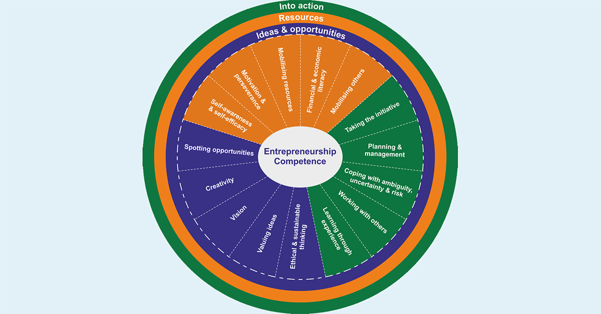
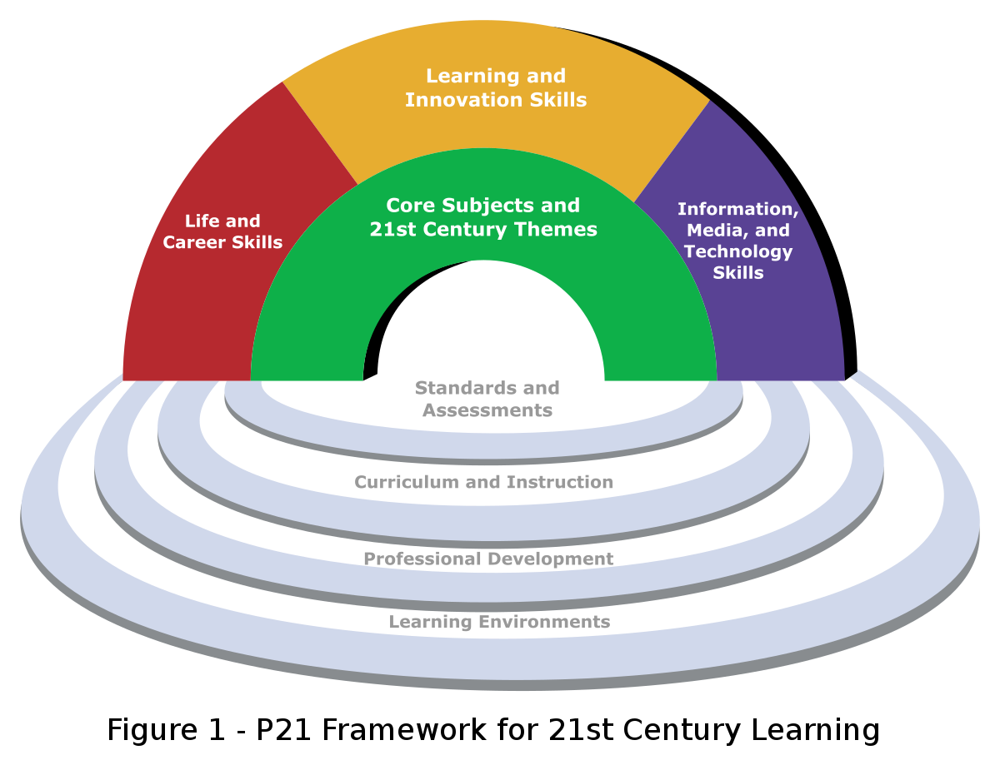

---
ebook:
  title: Lecture 02

export_on_save:
  ebook: "html"

---

<a href="https://zanna-37.github.io/I-E_Basis_2019/">Home</a>

# Innovation Skills

**Date**: 2019-10-09

# Table of Contents

[TOC]

-----

# Why skills? [📹0:00](https://youtu.be/yCTMpxLP-38)

* Difficult to innovate without skills `Example:` _Comunication, problem solving leadership, stress management, agility, teaching, technical skills, pitching, awareness, …_
* Skills are required for different fields `Example:` _Policy, academia, business_

There's no simple bucket to put these skills, there are different broad ranges we can consider. Skills take all sorts of things and a simple one.

## Skills

- Skills that can be applied to different fields
- Horizontal
- "Soft skills"
- Loosely defined

## Skill listing and grouping
- EntreComp (Entrepreneurshiop Competence Framework) → proposed by the European Union

  

- Future Work Skills 2020 → Skills for the new learners

  

- 21st Century Skills → P21 Framework

  

- OECD → Microsoft, intel, cisco

# Skill work [📹16:10](https://youtu.be/yCTMpxLP-38?t=969)
_Form a group and organize yourself to be able to choose a skill present it_

The presented topics were:

**Taking the Initiative** [📹16:10](https://youtu.be/yCTMpxLP-38?t=969)
**Financial & Economic Literacy** [📹21:22](https://youtu.be/yCTMpxLP-38?t=1282)
**Creativity** [📹26:12](https://youtu.be/yCTMpxLP-38?t=1572)
**Motivation & Perseverance** [📹31:16](https://youtu.be/yCTMpxLP-38?t=1876)
**Ethics & Social Responsibility** [📹34:21](https://youtu.be/yCTMpxLP-38?t=2061)
**Working with Others** [📹36:59](https://youtu.be/yCTMpxLP-38?t=2061)
**Learning through Experience** [📹42:02](https://youtu.be/yCTMpxLP-38?t=2522)

# Conclusion [📹47:07](https://youtu.be/yCTMpxLP-38?t=2827)
Skills are beyond entrepreneurship because they have application in many fields, even in daily life.
