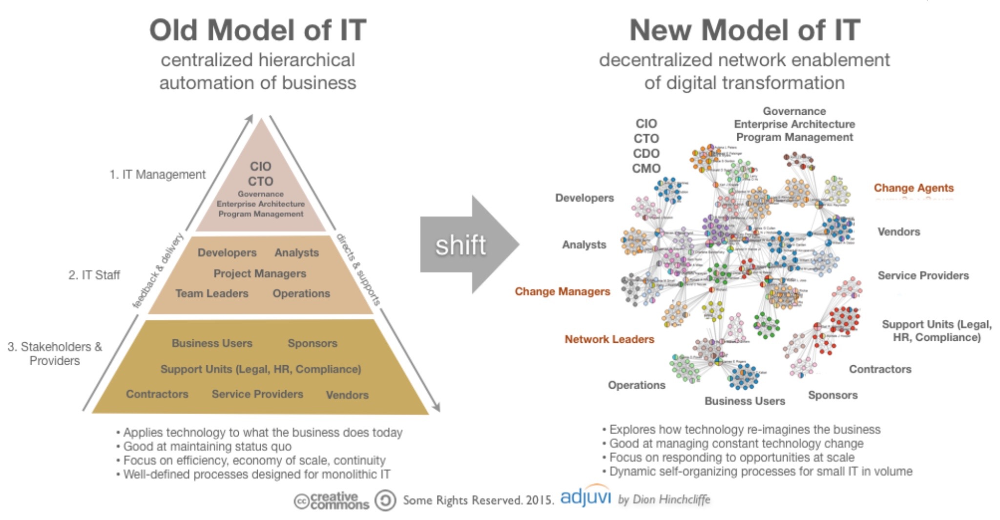

---
ebook:
  title: Lecture 03

export_on_save:
  ebook: "html"

---

<a href="https://zanna-37.github.io/I-E_Basis_2019/">Home</a>

# Entrepreneurship {ignore=true}

**Date**: 2019-10-14

# Table of Contents {ignore=true}

[TOC]

-----

# Who are entrepreneurs? What are their qualities? [📹0:00](https://youtu.be/h8b_GTZd2Ek)

- Be a leader
- Proactive
- Ready to take risk
  - Reward usually depends on the risk
- Open-minded
- Use the quality of their disposal to reach a goal

[📹17:03](https://youtu.be/h8b_GTZd2Ek?t=1023)
`Quote:` _"The entrepreneur always searches for change responds to it and exploits it as an opportunity" -Peter Drucker_

Technically, opening any kind of business is considered to be an entrepreneur, but not in the terms we are seeing in this course: in this course an entrepreneur is not just someone who opens a business, but a person with the above qualities.
In fact, entrepreneurs are not only people strictly related to business, but people who innovate `Example:`_Artists, teachers with innovative ways to teach, …_

It doesn't matter which age you are, you can always be an entrepreneur.

# Today vs past [📹13:24](https://youtu.be/h8b_GTZd2Ek?t=804)

We now live in a digital era in which there is a great technological development that requires qualifications we are gaining in this course. Instead of capitals we have qualifications and time to put at work.
In the past young people were not trusted by investors but time is changing this behavior.

# Who are the archetypes of Entrepreneurship? The Industrial Age Role Models [📹26:13](https://youtu.be/h8b_GTZd2Ek?t=1573)

- **Ford**: the symbol of the automobile industry, made cars accessible
- **Walt Disney**: he started the entertainment industry, making money while having fun
- **Mr. FedEx**: courier service, before FedEx people used the post office, they changed the way the business model was for some other companies
- **Olivetti** and **Ferrari**: ethical entrepreneurship and aesthetic entrepreneurship `Example:`_The factories are livable and beautiful, good condition for workers_
- **Edison**: bringing electricity to houses

# Technology Entrepreneurship: Entrepreneurship in the Domain of Technology [📹45:11](https://youtu.be/h8b_GTZd2Ek?t=2711)

 [📹1:01:46](https://youtu.be/h8b_GTZd2Ek?t=3706)
**4th Industrial Revolution**: is characterized by:

- digitalization in companies
- globalization
- penetration of internet and digital services in all spheres of life
- Different demographics `Example:`_Population aging, migrations, …_

Technology encompasses:

1. methods
2. processes
3. artefacts
4. tools
5. devices

That can be used in commercial and industrial uses.

Technology Entrepreneurship is how to use the new technological know-how to internalize in a company as innovation and put in a market to commercialize and scale-up. How to capture the value out of technological know-how?

Technological entrepreneurship ideas `Example:`_Smartphone as a computer in your pocket, Cryptocurrency, …_

# Model of IT [📹1:11:23](https://youtu.be/h8b_GTZd2Ek?t=4283)

The new model allows a new way to work (`Example:`_more flexibility, work remotly_), more based on teamwork and collaboration.

# Post modern role models [📹1:14:04](https://youtu.be/h8b_GTZd2Ek?t=4444)

- **Xerox**: big research and development became a consultancy
- **Konica-Minolta**: manufacturer of cameras is now a consultancy
- **3M**: research
- **N26/Revolut**: fully online bank
- **Barnes & Noble**: online book
- **Financial Times**: 90% of their business is now online

A lot of them digitalized something. Others moved their mission and now help other companies.

Tech Entrepreneurship was about the _performers_, _the founders_.
Instead companies **are now role models**: it is more important the performance than the performers, the founders are less important now to give space to the organization they run and the knowledge and skills they brought.

# Summary [📹1:26:52](https://youtu.be/h8b_GTZd2Ek?t=5212)

Entrepreneurial mindset and attitude are needed for every kind of job and situation. The new era is an era of entrepreneurial mindset which is normal behavior for humans, because humans are naturally curious and driven by motivation and goals.
