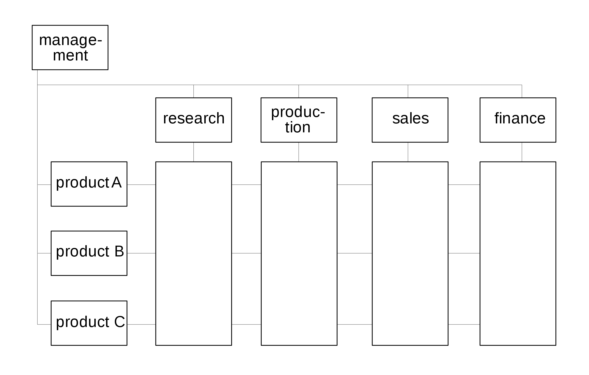

---
ebook:
  title: Lecture 06

export_on_save:
  ebook: "html"

---

<a href="https://zanna-37.github.io/I-E_Basis_2019/">Home</a>

# Organisations {ignore=true}

**Date**: 2019-11-04

# Table of Contents {ignore=true}

[TOC]

-----

# Introduction to Organisations [📹0:00](https://youtu.be/OrS0u7KuEYI)

**What are organisations and why do we need organisations?** Humans beings together are stronger. It suggests that there are roles. Rules. Hierarchy. Efficiency. Organisations exist to help with decision making.

**Why do we talk about organisations in an I&E class?** Companies are organisations. If we have to develop an idea, we need an organisation. If you set a certain goal, after you achieve the goal, you need to change the organisation. To use as a reference. Identify what works for you.

ICT companies that were present 50 years ago:

- IBM
- Olivetti
- Cisco
- AT&T
- Oracle

**Examples of organisations**:

* UN (United Nations)
* EU (European Union)
* Univesity
* Non-profit organisations
* Cities
* Orchestras
* Family

# Mann Gulch Disaster - Reading Tips [📹12:20](https://youtu.be/OrS0u7KuEYI?t=740)

* **Key points of failure**
  * Lack of following instruction
  * Radio is broke because the chute didn't open
* **"Cognitive dissonance"** - when you are expecting something rationally but your reaction is different. It tells you something is wrong here.
  * They get there expecting a dangerous situation but the ranger is having a meal and then the seniors proceed to also eat.
* How did the **organisation structure affect decision-making**?
  * The senior was the bottleneck of the organisation
* **Culture** and **decision-making**
  * They call themselves professional adventurers - they are confident, they trust their training, they are very independent → you don't follow the leader
* **Improvisation** - how much space?
  * Not a lot of space for improvisation, yet this is what saved the people that survived
* Organisation **structure** and **size**
  * The structure of the organisation doesn't fit with the size it has.
* Handling of **authority**
  * The authority wasn't respected, even though it clearly had more experience
* "**Lookahead**" for various classes of actors - "lookahead" is the ability to look past a situation and have a clear path to follow until a certain point.

Regarding this incident, the **key conclusions** for the firefights are:

* Having backup radios
* Escape fire is now a standard

The key conclusion for the **author of the paper** is that organisations need to be more resilient - one way is making it more democratic .

The conclusion of the **class** is that organisations need to have a way of dynamically change their structure.

# The Matrix Organisation [📹48:40](https://youtu.be/OrS0u7KuEYI?t=2920)

The **bug** in the matrix is that all the **transitions are very hard** (product A to B, sales to finance) to make and there are **double chains of command**.

# Case Studies [📹54:40](https://youtu.be/OrS0u7KuEYI?t=3280)

- How much can an individual impact the organisation?
- How quickly can the organiser respond to disruptions?
- How does the organisation innovate?
- How can the organisation scale?
- What are the key decisions the organisation makes?
- Where are the decision-making bottlenecks?

## Ubisoft

Ubisoft has a matrix/divisional structure which is more centralised and typical for corporations. They have managed to innovate through game pitches.

- **How much can an individual impact the organisation?** Little, an individual is assigned to a certain function within a certain project and that's the range of his influence in the company.
- **How quickly can the organiser respond to disruptions?** Surprisingly fast, Ubisoft had a bad game reveal and 2 weeks later had already implemented policies to prevent it from happening again.
- **How does the organisation innovate?** Mostly management.

## Valve

Valve, on the other hand, has a completely decentralised and flat organisational structure.

* **How much can an individual impact the organisation?** An individual in Valve has a lot of potential impact because they can decide where to contribute and they can start new projects or kill old ones.
* **How quickly can the organiser respond to disruptions?**  Quickly, sometimes the organisation is the responsible for disruption.
* **How does the organisation innovate?** An individual can decide to innovate and brings innovation to the organisation.
* **How can the organisation scale?** Right now, Valve is just scaling horizontally which will become impossible at some point.

## Supercell

Uses an upside-down organisation in which the units are not individuals but cells (or teams).

* **How much can an individual impact the organisation?** It is limited to the team they belong.
* **How quickly can the organiser respond to disruptions?** Very quickly, they can kill a cell and start a new one.
* **How can the organisation scale?** Very easily, just add new cells.

# Type of Organisational Structures

## Vertical Functional

An organisation with a functional structure is divided based on functional areas, such as IT, finance, or marketing. Functional departmentalisation arguably allows for **greater** operational  efficiency because employees with shared skills and knowledge are  grouped together by function. A **disadvantage** of this type of structure is that the different  functional groups may not communicate with one another, potentially  decreasing flexibility and innovation. A recent trend aimed at combating this disadvantage is the use of teams that cross traditional  departmental lines.

## Divisional

Divisional structures group various organisational functions into product or regional divisions. Each division contains all the necessary resources and functions within it to support that product line or geography (for example, its  own finance, IT, and marketing departments). A multidivisional form (or “M-form”) is a legal structure in which one parent company owns subsidiary companies, each of which uses the  parent company’s brand and name. The divisional structure is **useful** because failure of one division doesn’t directly threaten the other divisions. In the multidivisional  structure, the subsidiaries benefit from the use of the brand and  capital of the parent company. **Disadvantages** of divisional structure can include operational  inefficiencies from separating specialized function. For the multidivisional structure, disadvantages can include increased  accounting and taxes.

## Matrix

The matrix structure is a type of organisational structure in which individuals are grouped via two operational frames. Matrix structures are inherently complex and versatile, making them more appropriate for large companies operating across different industries or geographic regions. Proponents suggest that matrix management is **more dynamic** than  functional management in that it allows team members to share  information more readily across task boundaries; it also allows for specialisation that can increase depth of knowledge. A **disadvantage** of the matrix structure is the increased complexity  in the chain of command, which can lead to a higher manager-to-worker ratio and contribute to conflicting loyalties among employees.

## Team-Based

The team structure in large organisations is a newer type of organisational structure. A team should be a group of workers, with  complementary skills and synergistic efforts, all working toward a common goal. An organisation may have several teams that can change over time. Teams that include members from different functions are known as cross-functional teams. Although teams are characterized as less hierarchical, they typically still include a management structure (or management team). **Critics** argue that the use of the word “team” to describe modern organisational structures is a fad—that some teams are not really teams at all but merely groups of staff. One aspect of team-based structures likely to persist indefinitely is the integration of team cultures within an broader structure (such as a functional structure with interspersed teams).

## Network

The network structure is a newer type of organisational structure  viewed as less hierarchical (i.e., more “flat”), more decentralized, and more flexible than other structures. In a network structure, managers coordinate and control relationships that are both internal and external to the firm. The concept underlying the network structure is the social network—a social structure of interactions. Open communication and reliable  partners (both internally and externally) are key components of social  networks. Proponents argue that the network structure is more agile than other structures. Because it is decentralized, a network organisation has  fewer tiers, a wider span of control, and a bottom-up flow of decision  making and ideas. A **disadvantage** of the network structure is that this more fluid  structure can lead to more complex relations in the organisation.
