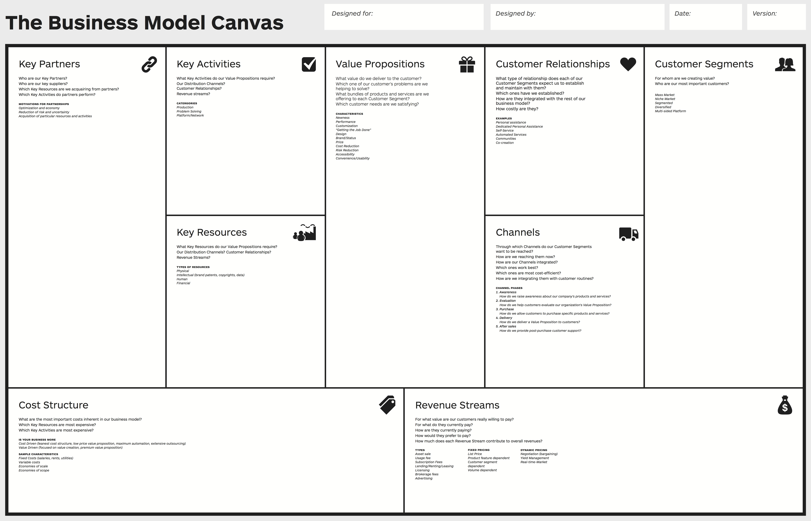

# Business Modelling {ignore=true}

**Date:** 2019-12-06

# Table of Contents {ignore=true}

[TOC]

# Business Model

A business model is a plan, it can include some of the following concepts:

* revenue streams/incomes;
* position on the market;
* marketing;
* partners;
* costs;
* targets;
* customers;
* competitors;
* plan;
* products;
* internal resources;
* channels.

A **business model** describes the rationale of how an organisation creates, delivers and captures value - starting from an **idea**. The business model core is about the conceptualisation of different elements and shows how you are creating value as company. It is about what, how and when you do something. If we are unable to create, deliver or capture value, the business model collapses. Business planning in no longer a model in which you can, per se, mobilise resources and execute it due to the boom of open innovation.

Business models change because markets flutuate and change, resources available change and recreating it is required. The business model offers a way to provide a response of the company to what the environment and the market are asking for.

Business modelling takes the technical aspects of a business into economic knowledge. The economic knowledge is more high level and allows for the understanding on how to manage on this level.

The same market doesn't imply that the bussiness models are the same. They can be very different. For example, in the game market, we can observe an evolution of the business models:

* The **arcades** work with a pay-per-play in which you have different trade-offs such as price, simultaneous people playing, duration of game. An example of this is the game conflict which without changing the business model allowed for asyncrhonous play of 4 players, meaning that you don't have to wait for another player to start playing.
* The appearance of **consoles** has the pay-per-game perspective in which you pay around 60€ for one game.
* **Free use** + pay for: access to levels, credits, lives and weapons or other futures.

The most single valuable asset in a company is **a paying customer**. Others include product, technology, vision, investors, management, company values, strong team, customer need, competitive advantage, money and a business plan.

To show that companies business models change over time, specially with digital transformation because it powered a change in all worlwide markets. Some great examples are General Electric, Nintendo (which started selling card games) and Nokia (which started with paper and rubber).

# Gartner's Hype Cycle

The Gartner's Hype Cycle shows the maturity, adoption and social application of specific technologies. It is related with the trends and what sort of what to expect in the future.

## The case of apps

Apps 4-5 years ago were extremely popular, everything was designed to be an app because at the time, that technology was at its peak. Right now, companies are no longer trying to create apps but great user experiences.