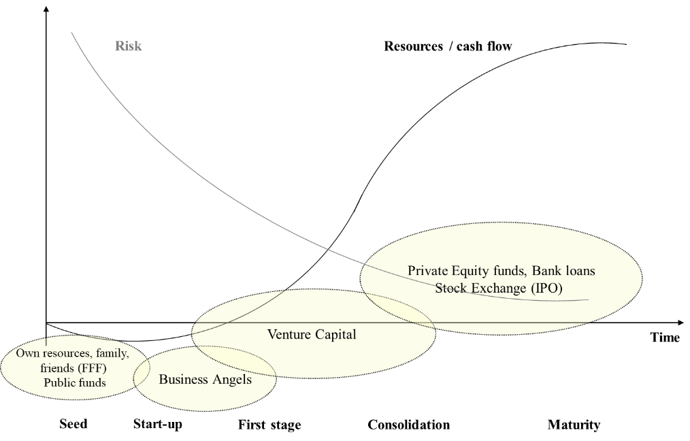

---
ebook:
  title: Lecture 10

export_on_save:
  ebook: "html"

---

<a href="https://zanna-37.github.io/I-E_Basis_2019/">Home</a>

# Venture Financing {ignore=true}

**Date**: 2019-12-09

# Table of Contents {ignore=true}

[TOC]

-----

# Sustainable growth

There is a relation between **country welfare** and **companies' growth**. Is this relation **direct** or **indirect**?

During the last years, the world's top 5 companies are all related to tech and there are no European ones. Europe is trying to push in order to be on that list with a representative in the next years.
Technology and innovation are becoming more and more important.

# Acronyms

| Acronym | Definition                           |
|:-------:| ------------------------------------ |
|   MVP   | Minimum Viable Product               |
|   FFF   | Family, Friends, Founders (or Fools) |
|   BA    | Business Angel                       |
|   VC    | Venture Capitalist                   |
|   PE    | Private Equity                       |
|   IPO   | Initial Public Offer                 |

# Venture financing cycle

At first you "lose" money, because of the expenses and the investment costs; then you start to earn.

In the first phase, the only people who believe in you are the **triple F**: Family, Friends, Founders (or Fools).
Then there are the **business angels** who help you `Example:`_with contacts_.
Then **venture capital**, when your product starts to gain success; they help you to reengineer the idea and to increase the selling.
Then you try to fund specific products with **private equity founds**, **bank loans**.
In the end, you go public with **stock exchange IPO (Initial Public Offer)**.

# Ways to get funds

## Debt Capital

- **Temporary** form of funding provided through a contractual basis
- One should return the capital plus the **debt remuneration**
- The credit provider does have **no operational power**

## Risk Capital

- **Stable** form of funding provided through a company governance agreement _(unlimited duration)_
- No contractual remuneration, but **only dividends**
- Capital provider _(co-owner)_ has the right to participate and **have an active role** in the enterprise governance

## Private Equity — Helpers

### Business Angel

- Physical person(s)
- Help to growth
- They allocate a fraction of their financial capability
- They usually know the start-up world
- Typical **invest** is between **50k to 250k Euro** _(even less in Italy)_
- Typical **expected return** on investment is above **20% per year**
- They are usually passionate about the idea, they don't do it only for the money

### Ventuare Capital

- Financial entities
- They want a sit in the decision board
- Usually competent on the domain
- Medium to long term period strategy (in 7 years they sell their shares)

# Bring the idea to financing

Having a good idea is difficult but you are not the only one who has good ideas. The most important part is to have a solid vision of the implementation.

Only 1% of the proposals reach the financing stage.
