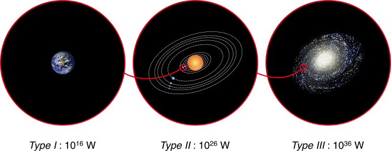

---
ebook:
  title: Battle 2

export_on_save:
  ebook: "html"

---

<a href="https://zanna-37.github.io/I-E_Basis_2019/">Home</a>

# Battle 2 - Utopian Eco

**Date**: 2019-11-13

# Table of Contents

[TOC]

-----

The battle is a battle of utopias that starts from the idea of the **Kardashev scale**[^1].
[^1]: **Kardashev scale** [[wikipedia](https://en.wikipedia.org/wiki/Kardashev_scale)] is a method of measuring a civilization's level of technological advancement based on the amount of energy they can use.
The scale has three designated categories:
• **Type I civilization** also called a **planetary civilization** can use and store all of the energy available on its planet.
• **Type II civilization** also called a **stellar civilization** can use and control energy at the scale of its solar system.
• **Type III civilization** also called a **galactic civilization** can control energy at the scale of its entire host galaxy.

**The question is "how do we bring humanity to become a type I civilization, able to fully control its planet?"**

There are two proposals:
- Ecology view _- by living in harmony with nature_
- Engineering view _- engineering the planet_

## Team Eco

- It's important to emphasize the **culture of silence, nature sounds** against the noise of machinery
- **Moving** in a new place to call home
  - Humanity decides to leave the planet Earth to go **to an orbiting ring** around our home-planet
  - Moving to the ring does not mean abandoning the Earth, but making a **better use** of it
    - Preserve nature
    - Preserve culture and art (monuments)
- How to produce **energy**?
  - **Fusion reactors** - a green alternative
- **Transportation** in the ring
  - Short distance - walking and cycling
  - Long distance - Hyperloop (a long non-stopping train)
- **Space elevator** to travel from and to the surface of Earth
- A world with **no money**
  - Abundant resources for every one
  - No theft
  - Money creates inequality and forces people to work

## Engineering powered utopia

- **Celebrating engineering**
- **Monitoring** climate events and energy consumption in the world
  - There are also measure tools that can be used to foresee the future with accurate models and plan interventions before a disaster arrive
- Plan on how to **deal with climate change**
- Ability to control the ecosystems and species
- **Biodiversity**
  - Technology to create a **genome library** with all the known species
    - to be deployed to ecosystems
    - to save them for the future
- Possibility to create or destroy ecosystems at will, also for research
- Energy production
  - **Nuclear fusion** for energy creation miniaturized to fill in a pods
  - Using water and solar systems
- No more cars to be substituted by **self-driving vehicles**
- **Recycling is mandatory**, and every waste is 100% recyclable, even minerals
- 3D simulated worlds
- **Vertical farms**
- Possibility to **engineer food**
- **Pipe for transportation**
- **Closed-system buildings**
  - Production inside buildings
- **Bacteria** genetically modified **to eat the CO~2~** in the atmosphere and clean the air
- **Genetic therapy** to fight diseases
- Digital chosen **diet**
